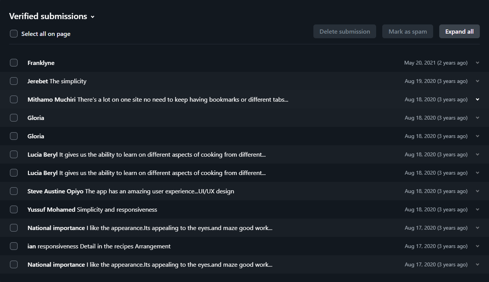

# HeadOverMeals

This is a frontend Recipe application built to display meal recipes to users. It makes use of a public API to show recipes of foods in various categories or those with popular ingredients. It also has an a searchbox to allow for users to search for meal recipes.

##  Tools
* HTML
* CSS
* JavaScript
* Fetch API
* Service Worker
* Caching

##  Lessons
This project showed me the importance of React in the development of single page application due to its cumbersome nature in the management of interfaces and DOM elements. It gave me the nurge I needed in learning React.
Another problem was the load times experienced when displaying the images from the urls. There was a clear pitfall in performance and this proved the need of having **resources stored locally**.

## Development and Design
The application was built as a **Progressive Web Application**. This was to allow the various resources to be stored in cache fails in the hopes of speeding up future load times. 
The application made use of a web manifest to realize this and also to allow adding the application to the users home screen and accessing it from there.

## Data collection
Forms data is collected using Netlify's own inbuilt form system and can be viewed on the Netlify's account dashboard.

## Hosting
The application is hosted on **Netlify** and you can view it here [HeadOverMeals](https://headovermeals.netlify.app/).

## User response
The feedback form collected some responses from my test users and the following is an image capture of the responses.
.

The responses were majorly positive and appreciative of the design and usability.